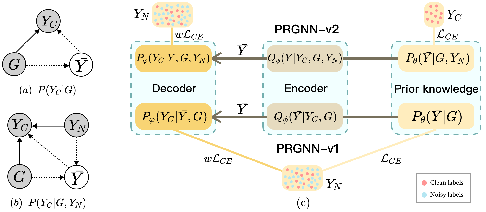

# PRGNN

This repository is the official implementation of *Probabilistic Graphical Model for Robust Graph Neural Networks against Noisy Labels*.
<!--  -->

## Setup

This implemetation is based on Python3. To run the code, you need the following dependencies:

> python==3.9.0 \
> torch==1.12.0 \
> torch-geometric==2.0.4 \
> torch-cluster==1.6.0 \
> torch-scatter==2.1.0 \
> torch-sparse==0.6.15 \
> torch-spline-conv==1.2.1 \
> networkx==2.8.5 \
> scikit-learn==1.1.3 \
> scipy==1.9.3 \
> numpy==1.23.5 \
> pandas==1.5.2

You can simply run 

```python
pip install -r requirements.txt
```
## Usage

train PRGNN-v1
```
python PRGNN-v1.py --dataset cora --noise_type flip --ptb 0.8
```
train PRGNN-v2
```
python PRGNN-v2.py --dataset cora --noise_type flip --ptb 0.8
```
